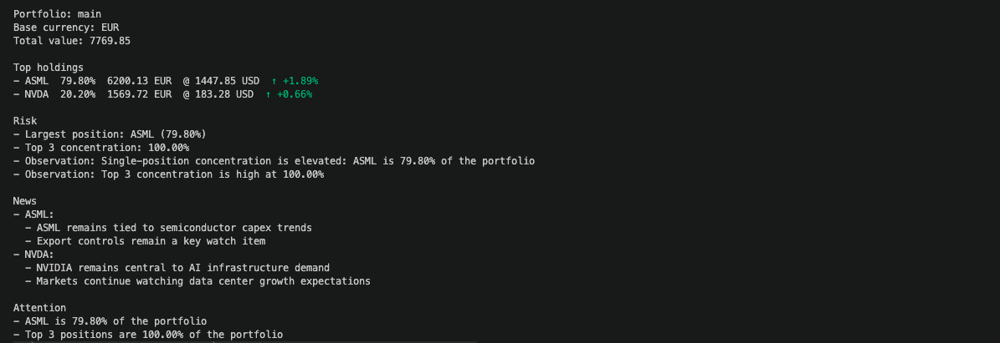

# tick

Terminal-native portfolio and market intelligence tool.

`tick` is a Bloomberg-style CLI for developers and investors. It
provides real-time portfolio valuation, risk insights, and market
context --- directly from your terminal, now with optional **local AI
analysis**.

------------------------------------------------------------------------

## Example Output



------------------------------------------------------------------------

## Features

### Portfolio Management

-   Create and manage portfolios
-   Add/update positions
-   Multi-currency support per position

### Valuation & Pricing

-   Live price data (via Finnhub)
-   FX conversion (via Frankfurter)
-   Portfolio base currency normalization
-   Cached pricing and FX (configurable TTLs)

### Analysis

-   Portfolio summary (weights, values)
-   Concentration risk analysis

### Daily Brief (`tick daily`)

-   Portfolio overview
-   Top holdings
-   Risk summary
-   News per holding
-   Attention signals
-   Daily price moves (% change with arrows)

### AI Analysis (`--ai`)

-   Local LLM support via Ollama
-   Generates concise daily insights
-   Fully private (no external API required)
-   Built on top of structured portfolio data

------------------------------------------------------------------------

## Getting Started

### Run locally

``` bash
go run ./cmd/tick daily
```

### With AI

``` bash
go run ./cmd/tick daily --ai
```

### Build the CLI

``` bash
go build -o bin/tick ./cmd/tick
./bin/tick daily
```

------------------------------------------------------------------------

## Example Usage

Create a portfolio:

``` bash
tick portfolio create main --base-currency EUR
```

Add positions:

``` bash
tick portfolio add NVDA --qty 10 --avg-cost 400 --currency USD --portfolio main
tick portfolio add ASML --qty 5 --avg-cost 850 --currency EUR --portfolio main
```

Run daily brief:

``` bash
tick daily
```

Run with AI:

``` bash
tick daily --ai
```

------------------------------------------------------------------------

## Configuration

`tick` is configured via environment variables (supports `.env`).

### Pricing & FX

``` env
PRICE_PROVIDER=finnhub
FX_PROVIDER=frankfurter

FINNHUB_API_KEY=your_api_key_here
```

### Caching

``` env
CACHE_ENABLED=true
CACHE_PRICE_TTL=15m
CACHE_FX_TTL=12h
```

### AI (Ollama)

``` env
LLM_ENABLED=true
LLM_PROVIDER=ollama
LLM_BASE_URL=http://localhost:11434
LLM_MODEL=llama3.1:8b
```

Install and run Ollama:

``` bash
brew install ollama
ollama pull llama3.1:8b
ollama run llama3.1:8b
```

------------------------------------------------------------------------

## Architecture

-   **domain** → core business entities
-   **services** → orchestration (pricing, reports, news)
-   **report** → structured output models
-   **usecases** → thin entry points
-   **adapters** → external integrations (APIs, LLMs)

------------------------------------------------------------------------

## License

MIT License
