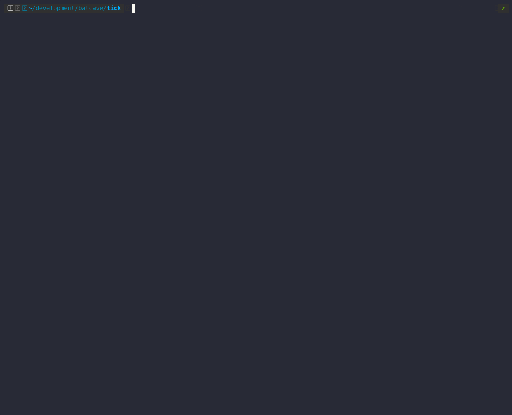

# tick

A simple CLI to track your portfolio from the terminal.



---

## ✨ Features

- 📊 Portfolio tracking (positions, cost basis, PnL)
- ⚡ Daily snapshot view (value, holdings, risk, news)
- ⚠️ Risk insights (concentration, largest positions)
- 📰 Headline-based market news per asset
- 🧾 Import support (CSV / external sources – WIP)

---

## 📦 Installation

### Homebrew (recommended)

```bash
brew tap squeakycheese75/tick
brew install tick
brew upgrade tick
```

### From source

```bash
git clone https://github.com/squeakycheese75/tick
cd tick
go build -o tick ./cmd/tick
```

---

## 🚀 Quick start

```bash
tick portfolio create main --base EUR

tick portfolio add BTC   --qty 0.5   --avg-cost 25536.60

tick portfolio add NVDA   --qty 10   --avg-cost 340.49

tick portfolio add MSTR   --qty 10   --avg-cost 120.00

tick portfolio summary

tick daily

tick news NVDA BTC MSTR
```

---

## 📸 Example

### Daily snapshot

```bash
tick daily
```

```text
main  36,283.76 EUR  Δ +6.38 EUR (+0.02%)

Holdings
BTC     91.04%    33,033.29 EUR  @    77,614.00 USD  → +0.00%  Δsnap +6.38 EUR (+0.00%)
NVDA     4.75%     1,723.72 EUR  @       202.50 USD  ↑ +1.31%
MSTR     4.21%     1,526.75 EUR  @       179.36 USD  ↑ +9.39%

Risk   Largest: BTC (91.04%)   Top 3: 100.00%   ! High concentration

News
BTC:  Why did Bitcoin price (BTC USD) and crypto stocks fall today after Fed chair nominee Kevin Warsh's
NVDA: NVIDIA remains central to AI infrastructure demand
```

---

### Portfolio summary

```bash
tick portfolio summary
```

```text
main

Base currency EUR
Total value   36,283.76 EUR
Total cost    17,194.64 EUR
Total PnL     +19,089.12 EUR  (+111.02%)

Positions
TICKER        QTY             PRICE             VALUE              COST                PNL     PNL %
BTC        0.5000     77,614.00 USD     33,033.29 EUR     12,768.30 EUR     +20,264.99 EUR  +158.71%
NVDA      10.0000        202.50 USD      1,723.72 EUR      3,404.88 EUR      -1,681.16 EUR   -49.38%
MSTR      10.0000        179.36 USD      1,526.75 EUR      1,021.46 EUR        +505.28 EUR   +49.47%
```

---

## 🧠 How it works

### `tick daily`
A compact snapshot answering:

> “How is my portfolio doing right now?”

### `tick portfolio summary`
A detailed accounting view answering:

> “What exactly do I hold and how is it performing?”

---

## 🛠 Commands

```bash
tick portfolio create main --base EUR
tick add MSTR --qty 1 --avg-cost 110.00
tick add BTC --qty 0.1 --avg-cost 30000.00
tick add NVDA --qty 10 --avg-cost 400.00

tick portfolio summary
tick portfolio risk

tick daily
tick news BTC MSTR
```

---

## 🧪 Status

Tick is under active development.

---

## 📄 License

MIT
